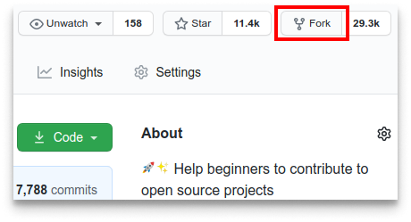
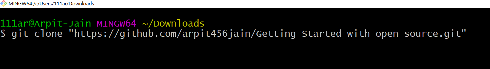
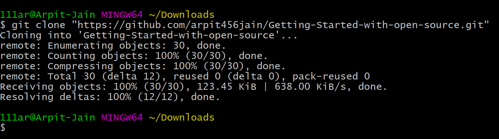
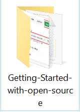
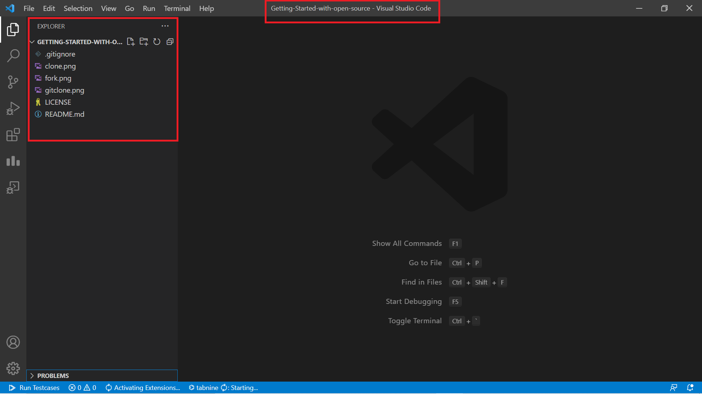
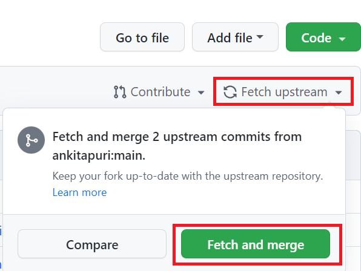
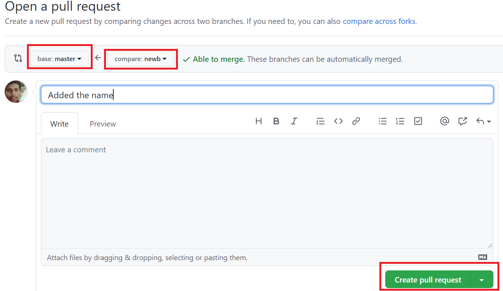
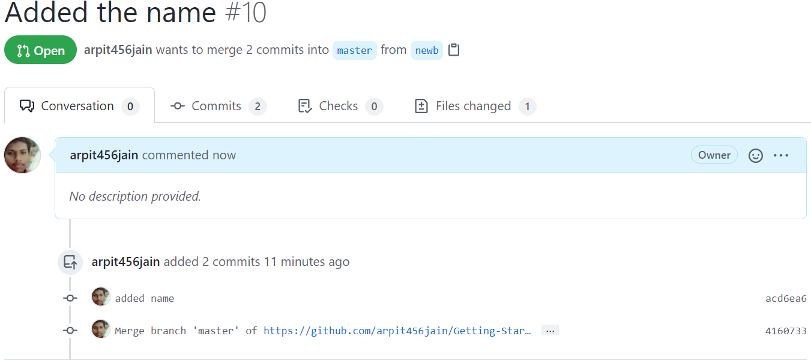
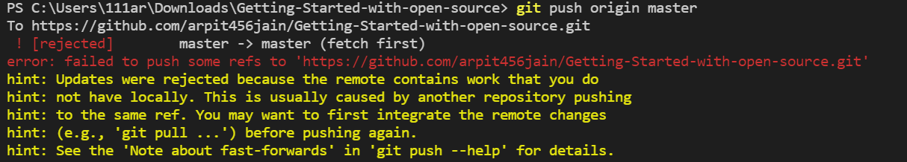
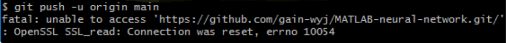

# Step-by-Step Guide for beginners for getting started with Open-Source

### This project is part of Hacktoberfest'21


### What is Git and Github?<br>
Git helps is maintaining the history of the project. It maintains a record of what changes were made to a project , when and by whom.
<br>Github is an online platform that hosts git repository.(Repository is a folder which saves all changes).<br><br>

## What is HacktoberFest?

**`Hacktoberfest`** is an `open-source competition` open to everyone in our global community. Whether you’re a developer, student learning to code, event host, or company of any size, you can help drive growth of open source and make positive contributions to an ever-growing community. All backgrounds and skill levels are encouraged to complete the challenge.

1. **`Hacktoberfest`** is a celebration open to everyone in our global community.
2. `Pull requests` can be made in any `GitHub-hosted` repositories/projects.
3. You can sign up anytime between `October 1` and `October 31`.

## Rules:

To earn your **`Hacktoberfest T-Shirt`** or tree reward, you must register and make four valid pull requests (PRs) between `October 1-31` (in any time zone). PRs can **NOT** be made to any public repo on GitHub, maintainers have to opt in with the topic **`Hacktoberfest`** on the repo. If a `maintainer` reports your pull request as `spam` or behavior not in line with the project’s code of conduct, you will be `ineligible` to participate. This year, the first **`70,000`** participants who successfully complete the challenge will be eligible to receive a `prize`.

## Projects in which you can contribute:

-   Any `github` repository with the **`Hacktoberfest`** topic
-   For the sake of convenience, you can contribute to this very project :)

<div align="center">
<h2> Here The Contribution Begins💻</h2>

#### If you are a beginner then this repository is for you. By this tutorial you are going to learn how to make your First Pull Request for sure.

 <h3 align="center">
    <a href="https://discord.gg/gtYUZQSjTt">👋 Join our discord community <strong>CodeSmashers</strong> </a>
    </h3>
    
    
## ⭐ STAR THIS REPOSITORY THIS WILL PAY OFF MY WORK 
</div>
<hr>

### 1. The first thing you need is Git installed on your system, if it is not installed then download it as per your OS and install it.

<h3>Git Setup :- </h3>
<ul>
<li><a href="https://git-scm.com/downloads">Download Git</a> as per your OS.</li>
<li>Git installation<a href="https://www.youtube.com/watch?v=2j7fD92g-gE"> Video</a> for Windows User</li>
<li>Git installation<a href="https://www.youtube.com/watch?v=ZM3I16Z-lxI"> Video</a> for Mac User</li>
<li>Git installation<a href="https://www.youtube.com/watch?v=PLQQ3tJwBJg"> Video</a> for Linux User</li>

<li>Install Git</li>
<li>Open the Git Bash ( Right Click )</li>
<li>Run the Commands</li>

`$ git config --global user.name "Your Name"`

`$ git config --global user.email youremail@example.com`

`$ git config --list`

<li>You should be able to see your entered name and email under <mark>user.name</mark> & <mark>user.email</mark></li>

</ul><br>
<hr>

### 2. You should have an account on GitHub if you you dont't have an account then simply make it.

### 3. You will need a text editor accoring to your comfort , I prefer Vs code

-   <a href="https://code.visualstudio.com/download">Download Vs Code</a> as per your OS.
-   Vs Code installation<a href="https://www.youtube.com/watch?v=MlIzFUI1QGA"> Video</a> as per your OS.

#### Other Text Editors

-   <a href="https://www.sublimetext.com/">Sublime Text</a>
-   <a href="https://atom.io/">Atom</a>
-   <a href="https://notepad-plus-plus.org/">Notepad++</a>
-   <a href="https://www.coffeecup.com/html-editor/">CoffeeCup HTML Editor</a>
-   <a href="https://macromates.com/">Text Mate</a>
-   <a href="https://www.vim.org/">Vim</a>
-   <a href="https://www.ultraedit.com/">Ultra Edit</a>
-   <a href="https://brackets.io/">Brackets</a>
-   <a href="https://www.codeblocks.org/">Code Block</a>

### 4. Now you just have to setup the project from GitHub to your local system.

<h3>Setting Project on your Local System :- </h3><br>
<ul>
<li>Fork this Repository or Project</li>
 <li> This will create a copy of this repository in your account.</li>
<br><br>
<li>Copy the link of the Repository</li><br>
<br><br>
<li>Open Git bash where you want to clone the project and clone it </li>
 <li>Clone it</li>
<li>Run Command and Hit Enter <br>
 
 ```
 git clone <the link you just copied>
 ```
 <br><br>
 
 In this case it is <br> ``` git clone  https://github.com/arpit456jain/Getting-Started-with-open-source.git ```
  </li>
 <li> After you hit enter you will notice that some downloading will start. It's actually cloning of repo form your GitHub repository to your local system.</li><br>
 
 <li> After this you will notice a folder is created with the name of repository </li><br>
 <br><br>
 <li>Then just close the Git bash and open this folder in your preferred text editor...</li><br>
 <li>Here is an example in VS Code. </li><br>
 <br><br>
</ul>

### 5. Now Make necessary changes and commit them , lets say you have to add your name in readme , you already set up the project in local system . Now before starting your work always rembember to pull latest change from the main Repo.

<ul>

 <li>Fetch And Merge </li><br>
 <br>
	<br>
 <li>Pull these changes in your local system</li>
 	<br>
 ```
 git pull origin master
 ```
	<br><br>
 The same command can also be divided into the following - <br>
	1. Fetching all commits from upstream <br>
	git fetch --all --prune<br>
	2. Reset the main branch of origin to upstream<br>
	git reset --hard upstream/main<br><br>
	
 <br><br>
 
 <li> make a new branch and then make the changes , then commit them. make sure to commit to the new branch <br>
 <b>Never commit in master branch</b> </li>
 
 ```
 git checkout -b new_branch_name
 git add -A
 git commit -a -m "message"
 ```
 <li>After commiting your changes on your local host you have to push that changes to GitHub , make sure you push the new branch </li>
 
 ```
git push origin new_branch_name
 ```

</ul>
  
### 6. Make the Pull Request
<ul>
<li>when you push the changes you will notice a new branch will be created on GitHub and there will be a green button for creating pull request. Click on it.</li>
<br>
<br><br> 
<li>After this a new page will be open like this</li>
<br><br>
<li>Now add a title and description of your PR and click on create pull request.</li>
<br>
<li>Congrats 🎉 your Pull Request is created</li><br>
<br><br>
</ul>

---

# Some Common Error And Their Solutions

### 1. Updates were rejected or failed to push some refs.

<br>

<p> This is most common error you will find and its pretty easy to solve . </p>
<br>
<p><b>Solution:</b> You just have to pull latest changes to your local system first and then you can push them </p>

```
git pull origin master
```

<p>
Note : if your repo is a forked one and its some commit behind then first fetch n merge then pull changes

</p>

### 2. Unable to detect identity.

<br>

<p> Its pretty easy to solve . </p>
<br>
<p><b>Solution:</b> You just have to write your username and email </p>

```
git config --global user.name "Your Name"
```

```
git config --global user.email youremail@example.com
```

### 3. Remote origin already exists.

<br>

<p>It is easy to solve<p>
<br>
<p><b>Solution:</b> You just have to update the URL of the remote repository with the name "origin" to the URL of the remote repository you want to add</p>

```
git remote set-url origin <repository url>
```

### 3. Refusing to merge unrelated histories.

<br>

<p>This error appears when some of your ambiguous actions confuse Git on how to function further.<p>
<br>
<p><b>Solution:</b> The solution to this fatal error is to use –allow-unrelated-histories flag with the git pull command or git merge command.</p>

```
git pull origin master –allow-unrelated-histories
```

### 3. OpenSSL SSL_read: Connection was reset.

<br>

<p>This is the SSL certificate of the server that has not been signed by a third party, so an error is reported.<p>
<br>
<p><b>Solution:</b> This error is most likely caused by network instability and connection timeout.</p>

```
git config http.sslVerify "false"
```
<br><br>
### 4. It is always best to make a new branch.
<br><br>
NEVER commit on the main branch.<br><br>
The importance of adding a new branch is that we can work on the code until our changes are finalized. Suppose you are working on a project that needs x changes. It will be easier for the maintainer to review changes one at a time instead of all the changes in a single PR. The maintainer can easily suggest changes in your PR on a particular issue.<br><br>
After finalizing and completing the code, the branch can be merged with the main branch. <br>
1 branch can only have one PR. <br><br>
<p>

---

# Common Git Commands you should know!!!

### 1. Git checkout

<li>You can use the checkout command to switch the branch that you are currently working on. </li>
 
 ```
git checkout <branch name>
 ```
<li>You can use the checkout command with `-b` to create a new branch and switch to the same. </li>
 
 ```
git checkout -b <branch name>
 ```

### 2. Git init

<li>This is the command you need to use if you want to start a new empty repository or to reinitialize an existing one in the project root. It will create a .git directory with its subdirectories. </li>
 
 ```
git init <repository name>
 ```

### 3. Git diff

<li>You can use this command to see the unstaged changes on the current branch. </li>
 
 ```
git diff
 ```

<li>If you want to see the staged changes. </li>
 
 ```
git diff --staged
 ```

<li>Or you can compare two branches: </li>
 
 ```
gif diff <branch1> <branch2>
 ```

### 4. Git add

<li>This is the command you need to use to stage changed files. You can stage individual files. </li>
 
 ```
git add <file path>
 ```

<li>You can also stage all files. </li>
 
 ```
git add .
 ```

### 5. Git branch

<li>Using git branch will list all the branches of the repository. </li>
 
 ```
git branch
 ```

<li>Or you can use it to create a new branch, without checking it out. </li>
 
 ```
git branch <new branch>
 ```

<li>To delete a branch. </li>
 
 ```
git branch -d <branch name>
 ```

### 6. Git log

<li>If you want to see what you have committed till now. </li>
 
 ```
git log
 ```

<li>If you want to see last 5 commits among 100000 commits. </li>
 
 ```
git log -p -1
 ```

### 7. Git merge

<li>Merge the changes made in a staging branch into the stable branch. </li>
 
 ```
git merge <branch_name>
 ```

### 8. Git rm

 <p>Remove files or directories from the working index (staging area). With git rm, there are two options to keep in mind: force and cached. Running the command with force deletes the file. The cached command removes the file from the working index. When removing an entire directory, a recursive command is necessary.</p>

<li>To remove a file from the working index (cached) </li>
 
 ```
git rm --cached <file name>
 ```

<li>To delete a file (force) </li>
 
 ```
git rm -f <file name>
 ```

<li>To remove an entire directory from the working index (cached) </li>
 
 ```
git rm -r --cached <directory name>
 ```

<li>To delete an entire directory (force) </li>
 
 ```
git rm -r -f <file name>
 ```

### 9. Git stash

 <p>To save changes made when they’re not in a state to commit them to a repository. This will store the work and give a clean working directory. For instance, when working on a new feature that’s not complete, but an urgent bug needs attention. </p>

<li>Store current work with untracked files </li>
 
 ```
git stash -u
 ```

<li>Bring stashed work back to the working directory </li>
 
 ```
git stash pop
 ```
 
 ### 10. Git clear

<li>To clean git bash. </li>
 
 ```
git clear
 ```

# Git Cheatsheet!!!

## SETUP

Configuring user information used across all local repositories

### 1. git config --global user.name “[firstname lastname]”

 <li>set a name that is identifiable for credit when review version history </li>

### 2. git config --global user.email “[valid-email]”

 <li> set an email address that will be associated with each history marker
 </li>

### 3. git config --global color.ui auto

 <li>set automatic command line coloring for Git for easy reviewing  </li>
 <br>

## SETUP & INIT

Configuring user information, initializing and cloning repositories

### 1. git init

 <li>initialize an existing directory as a Git repository </li>

### 2. git clone [url]

 <li> retrieve an entire repository from a hosted location via URL </li>
 <br>

## STAGE & SNAPSHOT

Working with snapshots and the Git staging area

### 1. git status

<li>show modified files in working directory, staged for your next commit </li>
 
 ### 2. git add [file]

<li>add a file as it looks now to your next commit (stage). This area contains a list of all the files you have recently changed. It tells Git that you want to include updates to a particular file in the next commit. </li>
 
 ### 3. git reset [file]

<li>Remove the specified file from the staging area, but leave the working directory unchanged. This unstages a file without overwriting any changes. </li>
 
 ### 4. git diff

 <li>diff of what is changed but not staged  </li>

### 5. git diff --staged

 <li>diff of what is staged but not yet commited  </li>

### 6. git commit -m “[descriptive message]”

 <li> commit your staged content as a new commit snapshot </li>
<br>

## BRANCH & MERGE

Isolating work in branches, changing context, and integrating changes

### 1. git branch

 <li>list your branches. a * will appear next to the currently active branch
 </li>

### 2. git branch [branch-name]

 <li>create a new branch at the current commit </li>

### 3. git checkout

 <li>switch to another branch and check it out into your working directory </li>

### 4. git merge [branch]

 <li>merge the specified branch’s history into the current one </li>
 <br>

## INSPECT & COMPARE

Examining logs, diffs and object information

### 1. git log

 <li>show the commit history for the currently active branch </li>

### 2. git log branchB..branchA

 <li>show the commits on branchA that are not on branchB </li>

### 3. git log --follow [file]

 <li>show the commits that changed file, even across renames </li>

### 4. git diff branchB...branchA

 <li>show the diff of what is in branchA that is not in branchB </li>

### 5. git show [SHA]

 <li>show any object in Git in human-readable format </li>
 <br>

## SHARE & UPDATE

Retrieving updates from another repository and updating local repos

### 1. git remote add [alias] [url]

 <li>add a git URL as an alias </li>

### 2. git fetch [alias]

 <li>fetch down all the branches from that Git remote </li>

### 3. git merge [alias]/[branch]

 <li>merge a remote branch into your current branch to bring it up to date </li>

### 4. git push [alias] [branch]

 <li>Transmit local branch commits to the remote repository branch </li>

### 5. git pull

 <li>fetch and merge any commits from the tracking remote branch </li>
 <br>
<hr>

## <ins> What if I have Merge Conflicts? </ins>

#### A GitHub conflict is when people make changes to the same area or line in a file. This must be fixed before it is merged in order to prevent collision in the main branch.

-   #### To read more about this, go to [Github Docs - About Merge Conflicts](https://docs.github.com/en/github/collaborating-with-pull-requests/addressing-merge-conflicts/about-merge-conflicts)
-   #### To find out about how to fix a Git Conflict, go to [Github Docs - Resolve Merge Conflict](https://docs.github.com/en/github/collaborating-with-pull-requests/addressing-merge-conflicts/resolving-a-merge-conflict-on-github)
	
	<br><br><b><h2>Video Link:</h2></b>https://youtu.be/apGV9Kg7ics
	<br>This video will help you to begin with Git and Github and start hosting projects on github or work on existing projects.<br>

---

## Now just make a Pull Request and add your name in Read me file.

## <ins>CodeSmashers Community<ins>

<!-- Please don't change the line above -->

-   ### **A** <br>

    -   [Arpit Jain](https://github.com/arpit456jain)
    -   [Arpit Jain](https://github.com/arpit456jain)
    -   [Amin Gholizad](https://github.com/AminGholizad)
    -   [Ankita Puri](https://github.com/ankitapuri)
    -   [Adarsh Navneet Sinha](https://github.com/geeky01adarsh)
    -   [Ananya Redhu](https://github.com/ananzzz)
    -   [Ankita Kumari](https://github.com/Ankita-21)
    -   [Atul Kesharwani](https://github.com/Atu77l)
    -   [Abhiyodaya Pandey](https://github.com/Abhiyodaya2002)
    -   [Arun Kumar Yadav](https://github.com/arunindian9648)
-   ### **B** <br>
    -   [Biswajit Debnath](https://github.com/BiswjitDebnath)
-   ### **C** <br>
-   ### **D** <br>
    -   [Dev Patel](https://github.com/devp73)
-   ### **E** <br>
-   ### **F** <br>
-   ### **G** <br>
-   ### **H** <br>
    -   [Himansh](https://github.com/ruhend)
-   ### **I** <br>
-   ### **J** <br>
-   ### **K** <br>
    -   [Kumari Astha Rani](https://github.com/astha2412)
    -   [Km Alan](https://github.com/alankemboi)
    -   [Kanchan](https://github.com/kanchan905)
    -   [Karan Boro](https://github.com/slothtae)
-   ### **L** <br>
-   ### **M** <br>
    -   [Manish Agrahari](https://github.com/manish831)
     -  [Malay Dewangan](https://github.com/Malaydewangan09)
    
    -   [Mitali Garg](https://github.com/Mitali-13)
-   ### **N** <br>
    -   [Neha Ajith](https://github.com/neha-ajith)
    -    [Naveen kushwaha](https://github.com/naveen3011)
    -   [nitish saini](https://github.com/nitishsaini706)
-   ### **O** <br>
-   ### **P** <br>
    -	[Prajwal Vijaykumar Mali](https://github.com/prajwalmali)
-   ### **Q** <br>
-   ### **R** <br>
-   ### **S** <br>
    -   [Siddharth Parashar](https://github.com/sidparashar2001)
    -   [Sejal Bhardwaj](https://github.com/sejalbhardwaj)
    -   [Sophiya Singh](https://github.com/sophiya02)
    -   [Suyash Gupta](https://github.com/sgalpha01)
    -   [Sanskriti Singh](https://github.com/ssanskriti-25)
    -	[Susmita Dey](https://github.com/Susmita-Dey)
-   ### **T** <br>
    -   [Tushar Kesarwani](https://github.com/TusharKesarwani)
-   ### **U** <br>
    -    [Urvi Gupta](https://github.com/urviigupta)
-   ### **V** <br>
    -   [Visinigiri Aditya](https://github.com/adityakumar48)
    -   [Vyom Gupta](https://github.com/vyomguptaa)
    -   [Vamshi Muluguri](https://github.com/vamshi726)
	
-   ### **W** <br>
-   ### **X** <br>
-   ### **Y** <br>
    -   [Yanala shivaprasad reddy](https://github.com/shivaprasadyanala)
-   ### **Z** <br>

   <h1 align=center> Project Admins ❤️ </h1>
<p align="center">
<table>
  <tbody><tr>
     <td align="center"><a href="https://github.com/arpit456jain"><br><sub><b> Arpit Jain </b></sub></a><br></td> </a></td>
     <td align="center"><a href="https://github.com/ankitapuri"><br><sub><b> Ankita Puri</b></sub></a><br></td></a></td>
	 <td align="center"><a href="https://github.com/astha2412"><br><sub><b> Kumari Astha Rani</b></sub></a><br></td></a></td>

</tbody></table>
<h2 align=center> ✨ Contributors </h2>

Thanks go to these **Wonderful People** 👨🏻‍💻: 🚀

<table>
	<tr>
		 <td>
  <a href="https://github.com/arpit456jain/Getting-Started-with-open-source/graphs/contributors">
  
  </a>
		</td>
	</tr>
</table>
<br>
<b>Contributions of any kind are welcome!</b>

## Open Source Programs [click here](https://github.com/arpit456jain/Open-Source-Programs)

## Some Open Source Projects you can contribute to.

| Project Name                                         | Tech Stack                                             |
| ---------------------------------------------------- | ------------------------------------------------------ |
| [PixelVibe](https://github.com/ankitapuri/pixelvibe) | HTML , CSS , Bootstrap , Java Script , Python , Django |
| [Cool Front-End Templates](https://github.com/arpit456jain/Cool-Front-End_Templates) | HTML , CSS , Bootstrap |
| [Amazing Css effects](https://github.com/arpit456jain/Amazing-Css-Effects) | HTML , CSS , Bootstrap |
| [Amazing Js Projects](https://github.com/arpit456jain/Amazing-Js-Projects) | HTML , CSS , Bootstrap, JS | 
| [Web-Development-Path-And-Resources](https://github.com/arpit456jain/Web-Development-Path-And-Resources) |Documentation |
| [Open-Source-Programs](https://github.com/arpit456jain/Open-Source-Programs) | documentaion | 

## show some ❤️&nbsp; by giving the star to this repo
adding name
